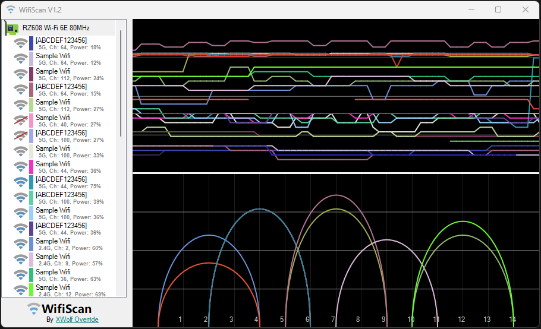

# WifiScan

Small and portable application for Wifi signals analyse in C# using Managed Wifi API.

## Options
Selecting a wifi network a panel is shown with some details.
You can change network color on graphics or hide network.
Space key also toggles between hide or show on graphics.